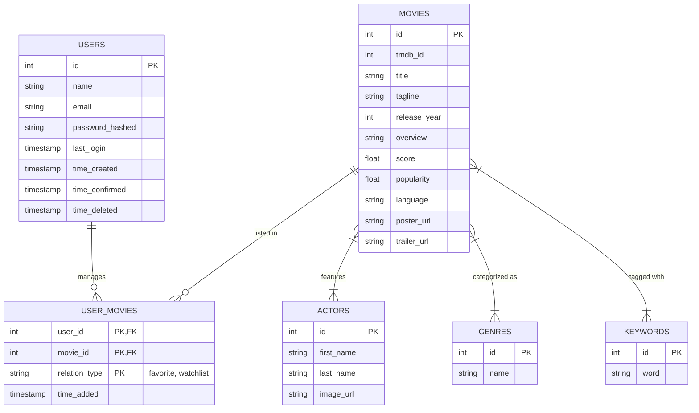

# Entity Relation Diagram

```mermaid
erDiagram
    USERS ||--o{ USER_MOVIES : "manages"
    MOVIES ||--o{ USER_MOVIES : "listed in"

    MOVIES }|--|{ ACTORS : "features"
    MOVIES }|--|{ GENRES : "categorized as"
    MOVIES }|--|{ KEYWORDS : "tagged with"

    USERS {
        int id PK
        string name
        string email
        string password_hashed
        timestamp last_login
        timestamp time_created
        timestamp time_confirmed
        timestamp time_deleted
    }

    USER_MOVIES {
        int user_id PK,FK
        int movie_id PK,FK
        string relation_type PK "favorite, watchlist"
        timestamp time_added
    }

    MOVIES {
        int id PK
        int tmdb_id
        string title
        string tagline
        int release_year
        string overview
        float score
        float popularity
        string language
        string poster_url
        string trailer_url
    }

    ACTORS {
        int id PK
        string first_name
        string last_name
        string image_url
    }

    GENRES {
        int id PK
        string name
    }

    KEYWORDS {
        int id PK
        string word
    }
```
