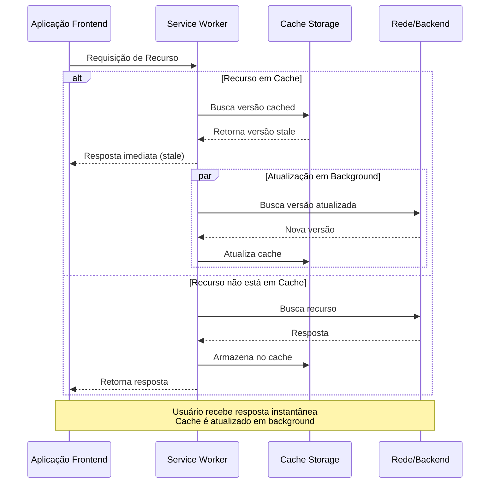
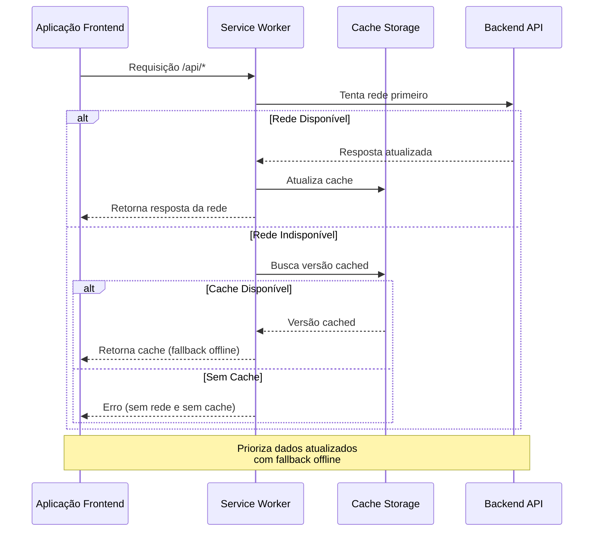

# Arquitetura do Projeto

## Padrões Arquiteturais

Este projeto segue os princípios de **Clean Architecture** e **Domain-Driven Design (DDD)**.

### Clean Architecture

A Clean Architecture organiza o código em camadas concêntricas, onde as dependências apontam sempre para dentro (em direção ao domínio):

```
┌─────────────────────────────────────────────────────────────┐
│                    Frameworks & Drivers                     │
│  ┌───────────────────────────────────────────────────────┐  │
│  │                  Interface Adapters                   │  │
│  │  ┌─────────────────────────────────────────────────┐  │  │
│  │  │              Application Layer                  │  │  │
│  │  │  ┌───────────────────────────────────────────┐  │  │  │
│  │  │  │           Domain Layer                    │  │  │  │
│  │  │  │  • Entities (regras de negócio)           │  │  │  │
│  │  │  │  • Value Objects                          │  │  │  │
│  │  │  │  • Repository Interfaces                  │  │  │  │
│  │  │  └───────────────────────────────────────────┘  │  │  │
│  │  │  • Use Cases (orquestração)                     │  │  │
│  │  └─────────────────────────────────────────────────┘  │  │
│  │  • Handlers (HTTP)                                    │  │
│  │  • Repository Implementations (PostgreSQL)            │  │
│  └───────────────────────────────────────────────────────┘  │
│  • HTTP Server, Database Driver, External APIs              │
└─────────────────────────────────────────────────────────────┘
```

### Domain-Driven Design (DDD)

Conceitos aplicados neste projeto:

| Conceito         | Descrição                                   | Exemplo no Projeto                       |
| ---------------- | ------------------------------------------- | ---------------------------------------- |
| **Entity**       | Objeto com identidade e comportamento       | `User`, `Movie`                          |
| **Value Object** | Objeto imutável definido por seus atributos | `Email`, `Password`                      |
| **Repository**   | Abstração para persistência                 | `UserRepository`, `MovieRepository`      |
| **Use Case**     | Orquestra operações do domínio              | `RegisterUseCase`, `GetTopMoviesUseCase` |

### Dependency Inversion Principle

As interfaces dos repositórios são definidas na camada de domínio (`server/internal/domain/repository/`), e as implementações concretas ficam na infraestrutura (`server/internal/infrastructure/postgres/`). Isso permite:

- Testar use cases sem banco de dados (mocks)
- Trocar a implementação de persistência sem afetar o domínio
- Manter o domínio independente de frameworks

---

## Estrutura de Pastas

```
movies/
├── server/                       # 🔧 Backend Go (Clean Architecture)
│   ├── cmd/                      # Entry points da aplicação
│   │   └── api/
│   │       └── main.go           # Ponto de entrada HTTP server
│   │
│   ├── internal/                 # Código interno (não exportável)
│   │   ├── domain/               # 🎯 Camada de Domínio
│   │   │   ├── entity/           # Entidades ricas com comportamento
│   │   │   │   ├── user.go       # Entidade User + regras de negócio
│   │   │   │   ├── movie.go      # Entidade Movie + comportamentos
│   │   │   │   └── mapper.go     # Conversão entity <-> model
│   │   │   ├── repository/       # Interfaces + erros de domínio
│   │   │   │   ├── user_repository.go
│   │   │   │   ├── movie_repository.go
│   │   │   │   └── errors.go     # Erros centralizados
│   │   │   └── valueobject/       # Value Objects imutáveis
│   │   │       ├── email.go      # Email com validação
│   │   │       └── password.go   # Password com hash/verify
│   │   │
│   │   ├── usecase/              # 📋 Camada de Aplicação
│   │   │   ├── account/          # Casos de uso de conta
│   │   │   │   ├── register.go
│   │   │   │   ├── authenticate.go
│   │   │   │   ├── get_favorites.go
│   │   │   │   ├── get_watchlist.go
│   │   │   │   └── save_to_collection.go
│   │   │   └── movie/            # Casos de uso de filmes
│   │   │       ├── get_top_movies.go
│   │   │       ├── get_random_movies.go
│   │   │       ├── get_movie_by_id.go
│   │   │       ├── search_movies.go
│   │   │       └── get_genres.go
│   │   │
│   │   ├── handler/              # 🌐 Camada de Interface (HTTP)
│   │   │   ├── account_handler.go # Endpoints de conta
│   │   │   └── movie_handler.go  # Endpoints de filmes
│   │   │
│   │   └── infrastructure/       # 🔧 Camada de Infraestrutura
│   │       └── postgres/         # Implementação PostgreSQL
│   │           ├── account_repository.go
│   │           └── movie_repository.go
│   │
│   ├── pkg/                      # Pacotes reutilizáveis
│   │   ├── logger/               # Logging
│   │   │   └── logger.go
│   │   └── token/                # JWT utilities
│   │       ├── creation.go
│   │       └── getsecret.go
│   │
│   ├── models/                   # DTOs (Data Transfer Objects)
│   │   ├── user.go               # DTO para API/persistência
│   │   ├── movie.go
│   │   ├── actor.go
│   │   └── genre.go
│   │
│   ├── database/                 # Scripts de banco de dados
│   │   ├── import/
│   │   │   ├── database-dump.sql
│   │   │   └── install.go
│   │   └── data/                 # Dados do PostgreSQL (volume)
│   │
│   ├── go.mod                    # Dependências Go
│   └── go.sum
│
├── web/                          # 🎨 Frontend (código fonte)
│   ├── src/                      # Código fonte JavaScript
│   │   ├── app.js                # Entry point da aplicação
│   │   ├── components/           # Web Components
│   │   │   ├── HomePage.js
│   │   │   ├── MovieDetailsPage.js
│   │   │   ├── MoviesPage.js
│   │   │   ├── AccountPage.js
│   │   │   └── ...
│   │   └── services/             # Serviços frontend
│   │       ├── API.js            # Cliente HTTP para backend
│   │       ├── Router.js         # Roteamento SPA
│   │       ├── Routes.js          # Definição de rotas
│   │       └── Store.js           # Estado da aplicação
│   ├── public/                   # Arquivos públicos
│   │   └── sw.js                 # Service Worker (cache SWR)
│   ├── index.html                # HTML principal
│   ├── styles.css                # Estilos CSS
│   ├── app.webmanifest           # PWA manifest
│   └── images/                   # Assets de imagem
│
├── public/                       # 📦 Build/Dist (gerado pelo build.sh)
│   ├── index.html                # HTML otimizado
│   ├── app.js                    # JavaScript bundle
│   ├── styles.css                # CSS otimizado
│   ├── sw.js                     # Service Worker (cache SWR)
│   ├── components/               # Web Components
│   ├── services/                 # Serviços frontend
│   ├── images/                   # Assets de imagem
│   └── app.webmanifest           # PWA manifest
│
├── build.sh                      # Script de build (web/ → public/)
├── Dockerfile                    # Build da aplicação
├── docker-compose.yaml           # Orquestração de containers
├── .air.toml                     # Configuração do Air (live reload)
├── .env.example                  # Exemplo de variáveis de ambiente
└── docs/                         # Documentação
    └── PROJECT_ARCHITECTURE.MD   # Este arquivo
```

### Separação Frontend/Backend

O projeto segue uma separação clara entre frontend e backend:

- **`server/`**: Todo o código backend em Go, seguindo Clean Architecture
- **`web/`**: Código fonte do frontend (Vanilla JavaScript) - onde você desenvolve
- **`public/`**: Build/dist do frontend - arquivos otimizados servidos pelo backend

**Workflow de Build:**

1. Desenvolve o frontend em `web/`
2. Executa `npm run build` na pasta `/web` para gerar `public/`
3. O servidor Go serve os arquivos de `public/` como arquivos estáticos

**Nota**: A pasta `public/` é gerada automaticamente e não deve ser versionada (está no `.gitignore`).

---

## Service Worker e Cache Strategy

O projeto implementa um **Service Worker** (`web/public/sw.js`) que atua como uma camada intermediária entre o frontend e a rede, proporcionando cache offline e melhor performance através da estratégia **SWR (Stale-While-Revalidate)**.

### Funcionalidades do Service Worker

1. **Cache Versionado**: Utiliza cache nomeado (`movies-cache-v1`) para facilitar atualizações e limpeza de caches antigos
2. **Estratégia SWR**: Para a maioria das requisições, retorna imediatamente a versão em cache (stale) enquanto busca uma versão atualizada em background
3. **Network-First para APIs**: Requisições para `/api/` utilizam estratégia network-first com fallback para cache
4. **Ativação Imediata**: Utiliza `skipWaiting()` e `clients.claim()` para ativação imediata após instalação

### Estratégias de Cache Implementadas

#### 1. Stale-While-Revalidate (SWR) - Requisições Gerais

- **Comportamento**: Retorna cache imediatamente se disponível, enquanto busca atualização em background
- **Aplicação**: Todos os recursos exceto `/api/`
- **Benefício**: Resposta instantânea ao usuário com dados atualizados em background

#### 2. Network-First com Cache Fallback - APIs

- **Comportamento**: Tenta rede primeiro, usa cache apenas se a rede falhar
- **Aplicação**: Todas as requisições para `/api/`
- **Benefício**: Garante dados atualizados quando possível, com fallback offline

### Registro do Service Worker

O Service Worker é registrado automaticamente na inicialização da aplicação (`app.js`):

```javascript
navigator.serviceWorker.register("/sw.js");
```

---

## Processo de Build e Deploy

### Desenvolvimento

1. **Frontend**: Edite os arquivos em `web/` diretamente
2. **Build**: Execute `./build.sh` para gerar `public/`
3. **Backend**: O código em `server/` é compilado e executado pelo Air (live reload)

### Produção

O `Dockerfile` automatiza o processo:

- **Stage 1 (dev)**: Monta volumes para desenvolvimento com hot reload
- **Stage 2 (builder)**: Compila o backend Go e executa `build.sh` para gerar `public/`
- **Stage 3 (prod)**: Imagem mínima com binário Go e arquivos estáticos de `public/`

---

## Diagrama de Arquitetura

```mermaid
graph TD
  subgraph Frontend [Frontend SPA]
    App[App.js]
    Router[Router Service]
    Routes[Routes Definitions]
    API[API Service]

    subgraph Components [Web Components]
      Pages[Page Components]
      Shared[Shared Components]
    end

    UI[HTML/CSS Interface]
  end

  subgraph SW [Service Worker Layer]
    SW[Service Worker<br/>sw.js]
    Cache[Cache Storage<br/>movies-cache-v1]
  end

  subgraph Backend [Backend - Clean Architecture]
    subgraph Handlers [Interface Layer]
      HTTP[HTTP Handlers]
    end

    subgraph UseCases [Application Layer]
      UC[Use Cases]
    end

    subgraph Domain [Domain Layer]
      Entities[Entities]
      VO[Value Objects]
      RepoInterface[Repository Interfaces]
    end

    subgraph Infra [Infrastructure Layer]
      RepoImpl[PostgreSQL Repositories]
      Logger[Logger]
      Token[JWT Token]
    end
  end

  subgraph Database [Persistence]
    DB[(PostgreSQL)]
  end

  subgraph External [External Resources]
    YouTube[YouTube Videos]
    TMDB[TMDB Images]
  end

  %% Frontend Flow
  App --> Router
  Router --> Routes
  Routes --> Pages
  Pages --> Shared
  Pages --> API
  Shared --> API
  Pages --> UI
  Shared --> UI

  %% Service Worker Interception
  API -- HTTP Requests --> SW
  UI -- Static Assets --> SW
  SW --> Cache
  SW -- SWR Strategy --> HTTP
  SW -- Network-First --> HTTP

  %% Backend Flow (Dependency Direction: Outside → Inside)
  HTTP --> UC
  UC --> Entities
  UC --> VO
  UC --> RepoInterface
  RepoImpl -.implements.-> RepoInterface
  RepoImpl --> DB

  %% Infrastructure
  HTTP --> Logger
  UC --> Logger
  HTTP --> Token

  %% External Resources
  UI --> YouTube
  UI --> TMDB

  %% Styling
  classDef domain fill:#e1f5fe,stroke:#01579b
  classDef application fill:#fff3e0,stroke:#e65100
  classDef interface fill:#f3e5f5,stroke:#4a148c
  classDef infra fill:#e8f5e9,stroke:#1b5e20
  classDef sw fill:#fff9c4,stroke:#f57f17

  class Entities,VO,RepoInterface domain
  class UC application
  class HTTP interface
  class RepoImpl,Logger,Token infra
  class SW,Cache sw
```

### Estratégia SWR (Stale-While-Revalidate)

O diagrama abaixo detalha o fluxo da estratégia SWR implementada pelo Service Worker:



### Estratégia Network-First para APIs

Para requisições de API (`/api/*`), o Service Worker utiliza uma estratégia diferente:



---

## Fluxo de uma Requisição

```
┌──────────┐    ┌─────────┐    ┌─────────┐    ┌──────────┐    ┌────────┐
│  Client  │───▶│ Handler │───▶│ UseCase │───▶│ Entity/  │───▶│  Repo  │
│  (HTTP)  │    │         │    │         │    │ ValueObj │    │ (impl) │
└──────────┘    └─────────┘    └─────────┘    └──────────┘    └────────┘
                                                                   │
                                                                   ▼
                                                              ┌────────┐
                                                              │   DB   │
                                                              └────────┘
```

**Exemplo: Registro de usuário**

1. **Handler** recebe requisição HTTP com `{name, email, password}`
2. **UseCase** (`RegisterUseCase`) é chamado
3. **Value Objects** (`Email`, `Password`) validam e encapsulam os dados
4. **Entity** (`User`) é criada com as regras de negócio
5. **Repository** (interface) persiste via implementação PostgreSQL
6. **Handler** retorna resposta JSON com JWT

---

## Models vs Entities

| Aspecto           | `server/models/` (DTOs)       | `server/internal/domain/entity/` |
| ----------------- | ----------------------------- | -------------------------------- |
| **Campos**        | Públicos                      | Privados                         |
| **Comportamento** | Nenhum                        | Métodos de negócio               |
| **Uso**           | Serialização JSON, Scan do DB | Lógica de domínio                |
| **Mutabilidade**  | Livre                         | Controlada por métodos           |

O `mapper.go` converte entre DTOs e Entities quando necessário.
