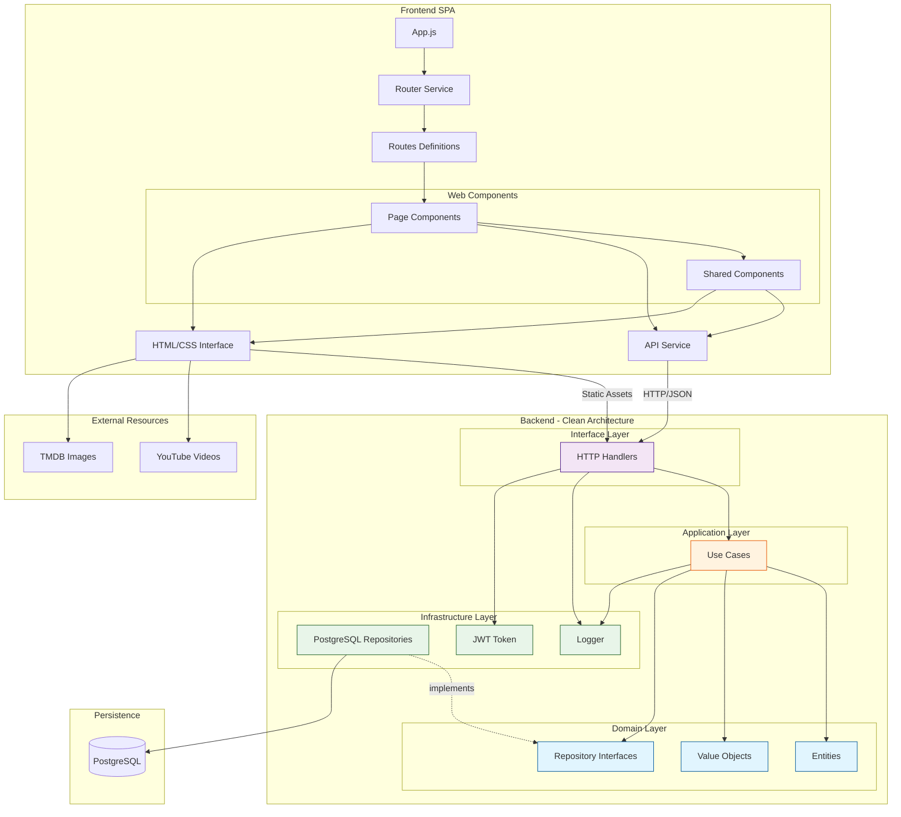

# Arquitetura do Projeto

## Padrões Arquiteturais

Este projeto segue os princípios de **Clean Architecture** e **Domain-Driven Design (DDD)**.

### Clean Architecture

A Clean Architecture organiza o código em camadas concêntricas, onde as dependências apontam sempre para dentro (em direção ao domínio):

```
┌─────────────────────────────────────────────────────────────┐
│                    Frameworks & Drivers                     │
│  ┌───────────────────────────────────────────────────────┐  │
│  │                  Interface Adapters                   │  │
│  │  ┌─────────────────────────────────────────────────┐  │  │
│  │  │              Application Layer                  │  │  │
│  │  │  ┌───────────────────────────────────────────┐  │  │  │
│  │  │  │           Domain Layer                    │  │  │  │
│  │  │  │  • Entities (regras de negócio)           │  │  │  │
│  │  │  │  • Value Objects                          │  │  │  │
│  │  │  │  • Repository Interfaces                  │  │  │  │
│  │  │  └───────────────────────────────────────────┘  │  │  │
│  │  │  • Use Cases (orquestração)                     │  │  │
│  │  └─────────────────────────────────────────────────┘  │  │
│  │  • Handlers (HTTP)                                    │  │
│  │  • Repository Implementations (PostgreSQL)            │  │
│  └───────────────────────────────────────────────────────┘  │
│  • HTTP Server, Database Driver, External APIs              │
└─────────────────────────────────────────────────────────────┘
```

### Domain-Driven Design (DDD)

Conceitos aplicados neste projeto:

| Conceito         | Descrição                                   | Exemplo no Projeto                       |
| ---------------- | ------------------------------------------- | ---------------------------------------- |
| **Entity**       | Objeto com identidade e comportamento       | `User`, `Movie`                          |
| **Value Object** | Objeto imutável definido por seus atributos | `Email`, `Password`                      |
| **Repository**   | Abstração para persistência                 | `UserRepository`, `MovieRepository`      |
| **Use Case**     | Orquestra operações do domínio              | `RegisterUseCase`, `GetTopMoviesUseCase` |

### Dependency Inversion Principle

As interfaces dos repositórios são definidas na camada de domínio (`internal/domain/repository/`), e as implementações concretas ficam na infraestrutura (`internal/infrastructure/postgres/`). Isso permite:

- Testar use cases sem banco de dados (mocks)
- Trocar a implementação de persistência sem afetar o domínio
- Manter o domínio independente de frameworks

---

## Estrutura de Pastas

```
movies/
├── cmd/                          # Entry points da aplicação
│   └── api/
│       └── main.go               # Ponto de entrada HTTP server
│
├── internal/                     # Código interno (não exportável)
│   ├── domain/                   # 🎯 Camada de Domínio
│   │   ├── entity/               # Entidades ricas com comportamento
│   │   │   ├── user.go           # Entidade User + regras de negócio
│   │   │   ├── movie.go          # Entidade Movie + comportamentos
│   │   │   └── mapper.go         # Conversão entity <-> model
│   │   ├── repository/           # Interfaces + erros de domínio
│   │   │   ├── user_repository.go
│   │   │   ├── movie_repository.go
│   │   │   └── errors.go         # Erros centralizados
│   │   └── valueobject/          # Value Objects imutáveis
│   │       ├── email.go          # Email com validação
│   │       └── password.go       # Password com hash/verify
│   │
│   ├── usecase/                  # 📋 Camada de Aplicação
│   │   ├── account/              # Casos de uso de conta
│   │   │   ├── register.go
│   │   │   ├── authenticate.go
│   │   │   ├── get_favorites.go
│   │   │   ├── get_watchlist.go
│   │   │   └── save_to_collection.go
│   │   └── movie/                # Casos de uso de filmes
│   │       ├── get_top_movies.go
│   │       ├── get_random_movies.go
│   │       ├── get_movie_by_id.go
│   │       ├── search_movies.go
│   │       └── get_genres.go
│   │
│   ├── handler/                  # 🌐 Camada de Interface (HTTP)
│   │   ├── account_handler.go    # Endpoints de conta
│   │   └── movie_handler.go      # Endpoints de filmes
│   │
│   └── infrastructure/           # 🔧 Camada de Infraestrutura
│       └── postgres/             # Implementação PostgreSQL
│           ├── account_repository.go
│           └── movie_repository.go
│
├── pkg/                          # Pacotes reutilizáveis
│   ├── logger/                   # Logging
│   │   └── logger.go
│   └── token/                    # JWT utilities
│       ├── creation.go
│       └── getsecret.go
│
├── models/                       # DTOs (Data Transfer Objects)
│   ├── user.go                   # DTO para API/persistência
│   ├── movie.go
│   ├── actor.go
│   └── genre.go
│
├── database/                     # Scripts de banco de dados
│   └── import/
│       ├── database-dump.sql
│       └── install.go
│
├── public/                       # Frontend SPA
│   ├── index.html
│   ├── app.js
│   ├── styles.css
│   ├── components/               # Web Components
│   └── services/                 # Serviços frontend
│
└── docs/                         # Documentação
```

---

## Diagrama de Arquitetura



---

## Fluxo de uma Requisição

```
┌──────────┐    ┌─────────┐    ┌─────────┐    ┌──────────┐    ┌────────┐
│  Client  │───▶│ Handler │───▶│ UseCase │───▶│ Entity/  │───▶│  Repo  │
│  (HTTP)  │    │         │    │         │    │ ValueObj │    │ (impl) │
└──────────┘    └─────────┘    └─────────┘    └──────────┘    └────────┘
                                                                   │
                                                                   ▼
                                                              ┌────────┐
                                                              │   DB   │
                                                              └────────┘
```

**Exemplo: Registro de usuário**

1. **Handler** recebe requisição HTTP com `{name, email, password}`
2. **UseCase** (`RegisterUseCase`) é chamado
3. **Value Objects** (`Email`, `Password`) validam e encapsulam os dados
4. **Entity** (`User`) é criada com as regras de negócio
5. **Repository** (interface) persiste via implementação PostgreSQL
6. **Handler** retorna resposta JSON com JWT

---

## Models vs Entities

| Aspecto           | `models/` (DTOs)              | `internal/domain/entity/` |
| ----------------- | ----------------------------- | ------------------------- |
| **Campos**        | Públicos                      | Privados                  |
| **Comportamento** | Nenhum                        | Métodos de negócio        |
| **Uso**           | Serialização JSON, Scan do DB | Lógica de domínio         |
| **Mutabilidade**  | Livre                         | Controlada por métodos    |

O `mapper.go` converte entre DTOs e Entities quando necessário.
