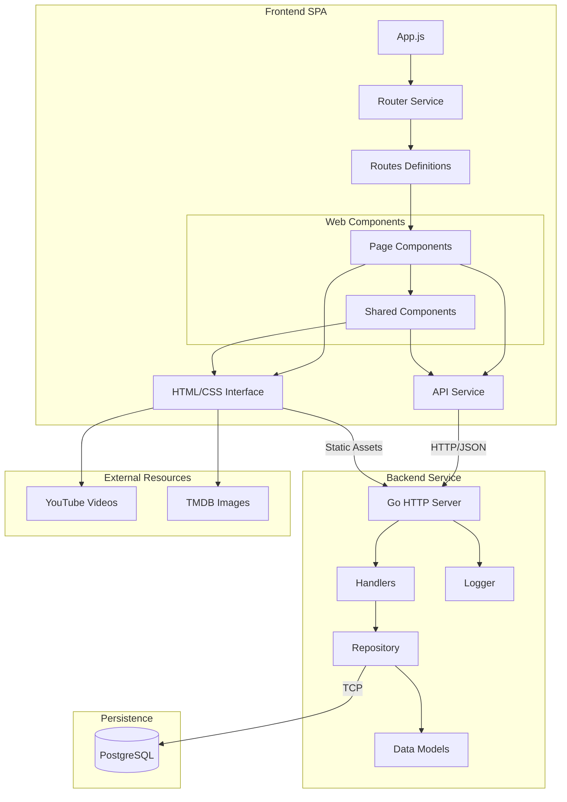

## Diagrama de Arquitetura do Projeto

```mermaid
graph TD
  subgraph Frontend [Frontend SPA]
    App[App.js]
    Router[Router Service]
    Routes[Routes Definitions]
    API[API Service]

    subgraph Components [Web Components]
      Pages[Page Components]
      Shared[Shared Components]
    end

    UI[HTML/CSS Interface]
  end

  subgraph Backend [Backend Service]
    Server[Go HTTP Server]
    Handlers[Handlers]
    Repository[Repository]
    Models[Data Models]
    Logger[Logger]
  end

  subgraph Database [Persistence]
    DB[(PostgreSQL)]
  end

  subgraph External [External Resources]
    YouTube[YouTube Videos]
    TMDB[TMDB Images]
  end

  %% Frontend Flow
  App --> Router
  Router --> Routes
  Routes --> Pages
  Pages --> Shared
  Pages --> API
  Shared --> API
  Pages --> UI
  Shared --> UI

  %% Frontend to Backend
  API -- HTTP/JSON --> Server
  UI -- Static Assets --> Server

  %% Backend Flow
  Server --> Handlers
  Handlers --> Repository
  Repository --> Models
  Server --> Logger

  %% Database Interaction
  Repository -- TCP --> DB

  %% External Resources
  UI --> YouTube
  UI --> TMDB
```
